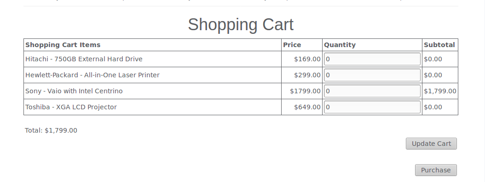
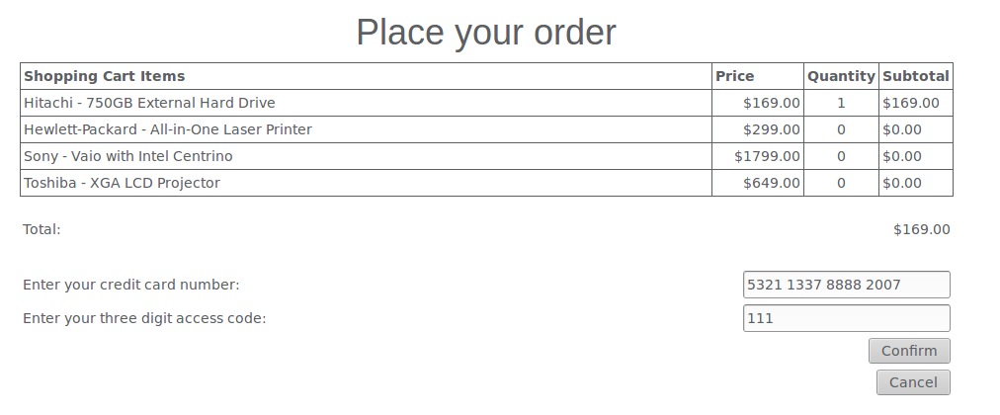

# Concurrency Code Review

## Overview
Review this code for concurrency issues and suggest a solution via a PR or create an issue explaining how to approach it

## Some Background
This is taken from an older version of WebGoat and cleaned up to be more reviewable in the time we have. 

The web pages that relate look like this ...

### Purchase Page

This is where you put in the quantity for each item. When you click purchase ...

### Confirm Page

This is where you confirm your purchase and it is completed.
