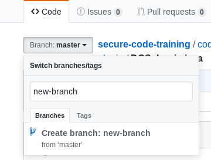
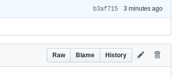
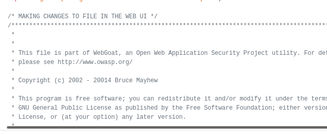

# Set Up Instructions for Labs

## ZAP
We will be using OWASP ZAP some as an intercept proxy in the labs. You will need to download and set it up.

## Git Client Setup
We will be using git/github to do some code review. You can technically do it all in the web UI, but if you want to pracice using git/gitflow, you should set up a git client. The instructions here will assume a git command-line client, but can often be translated into GUI client commands readily.

1. Check your IDE and/or command line. In your command line, type `git --version` to see if it is installed and which version. Most modern systems will have > 2.x. Most IDE's also ship with git support.
2. If not installed, go to https://git-scm.com/downloads or [on linux] use your package manager to install (e.g. `sudo apt-get install git`).

## Code Review Account
There will be snippets of code provided within this repo. Your task will be to create issues or pull requests (PRs) against those 
code snippets. You may use an existing github account or an account can be provided for you for this training in the case you do not have one, or do not wish to use your own account.

### Pull Requests in Git (well, GitHub)

### Creating a PR using git client/command-line
1. Clone the repo (https://help.github.com/en/articles/cloning-a-repository)
2. Create a local branch
  * `cd <your-repo>`
  * `git checkout -b <your-new-branch-name>`
3. Make your changes to the code you want to
4. Optional: `git status` to see what has changed
5. Stage your modifications using `git add`
  * .e.g if you modified `src/java/foo/bar/somecode.java` and you are in the project root, run ... `git add src/java/foo/bar/somecode.java`
  * NOTE: you can add whole directories and subdirectories, but doing something like `git add src/
6. Optional: `git status` to see what has changed and make sure what you changed is now staged
7. Commit your changes ... `git commit -m "Your Commit Message Here"
  * NOTE: this commits your changes *locally only*
8. Push your changes with `git push -u origin <your-branch-name>`

No ... we're not quite done, but this will get easier as you do it more often. Now we actually create the PR

#### Creating a PR
1. Go to to base of the repo in the Web UI and you will see a message like this ... 

2. Click 'Compare & Pull Request'
3. Fill out the title & description and click 'Create Pull Request'

... That's as far as we'll go here today. We will review/discuss the PRs as in a code review during the training.

#### Creating a PR through the Web UI
1. Navigate to your repository
2. Create and/or select a branch of the code

3. Click the edit (pencil) button at the top-right of the content of the file

4. Make your edits

5. Scroll down, add a commit message ... Optionally select the email associated with the commit and click `Commit changes`.
6. follow the instructions above for [creating a PR](#creating-a-pr)
