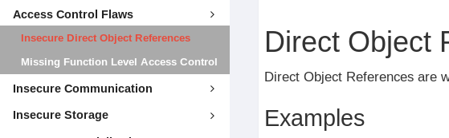

# WebGoat Labs

## 1. HTML Tampering && Client Filter Bypassing

### 1a) HTML Tampering
Do the HTML Tampering Labs in WebGoat. This one is pretty simple. Just use ZAP to tamper the form submission and get a discount.

### 1b) Client Filter Bypassing
Also feel free to similarly bypass client-side filters here with your proxy ... but there's not fancy TV to be had, sorry.

## 2) Injection Labs

### 2a) SQL Injection
Do the SQL Injection labs shown here. Do as little or as much as you like.

### 2b) XXE
eXternal XML Entity [injection] attacks get their own heading under OWASP Top 10, but for all intents and purposes are an injection attack. We'll talk about this one shortly after SQL Injection and then do the labnsecure .irect 
bject eference

### 2c) XSS
Do the XSS lesson/s. Again, as little or as much as you like and whatever interests you more.

**HINT**: If you're stumped on the mitigation exercise, take a look here: https://www.owasp.org/index.php/OWASP_Java_Encoder_Project#tab=Use_the_Java_Encoder_Project

## 3) Passwords and Secrets Lab

### Password Resets, Bypasses
You can do one or both of the the *Password reset* or *Authentication bypass* lessons/labs in WebGoat. Both are centered around getting around password reset functionality/requirements. The *Password reset* lab requires WebWolf also be running. If it is not, please skip that lab.

## 4) Access Control

### Insecure Direct Object Reference / Missing Function Level Access Control
Please do the two labs as titled above. Note that there is more than one way to 'break' the function level access control. We will do a follow-on lab discussing that and web services.

## 5) Secrets Storage Lab 

### Secrets Storage Lab
See if you can decode, lookup or decrypt the following items. Even if you can identify the type of hashing, encryption or encoding that's a start

* `2bc38374ec80b7391553545629b26c57c67a0a85`
* `fb21c2ab6cd9b379b94c304af0432fea`
* `UW1Gek16WTBJVEUxWlc1ak1HUXhibWNo`
* `ad719ba95e2ccc93f6a75f0734e884a3`
* `d5dd82f5d747c7e4a5644c53904aab0a5d03c940895765fdb321bb773e2521f1deb432ef6c582105a4c18642ca430519289e4a50b6a9223c3311c1b05f3a6400`

## 6) Using Git, creating PRs

We will walk through, answer questions on how to use git, github, create issues and pull requests (PRs)

## 7) MisConfiguration

### Go to https://github.com/foothill-security/secure-code-training/tree/master/code-review/java/misconfig and review the two files there. You can create an issue or a pull request, whichever you prefer. Also feel free to team up on creating those.

## 8) Deserialization

### Deserialization Code Review

Go to https://github.com/foothill-security/secure-code-training/tree/master/code-review/java/deserialization and review the DeserializeTask.java code. Issue a PR and/or create an issue ID'ing the problem and suggesting how to go about fixing it.