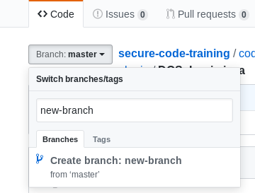
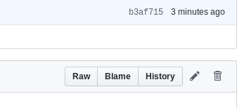

## Pull Requests in Git (well, GitHub)

## Creating a PR using git client/command-line
1. Clone the repo (https://help.github.com/en/articles/cloning-a-repository)
2. Create a local branch
  * `cd <your-repo>`
  * `git checkout -b <your-new-branch-name>`
3. Make your changes to the code you want to
4. Optional: `git status` to see what has changed
5. Stage your modifications using `git add`
  * .e.g if you modified `src/java/foo/bar/somecode.java` and you are in the project root, run ... `git add src/java/foo/bar/somecode.java`
  * NOTE: you can add whole directories and subdirectories, but doing something like `git add src/
6. Optional: `git status` to see what has changed and make sure what you changed is now staged
7. Commit your changes ... `git commit -m "Your Commit Message Here"
  * NOTE: this commits your changes *locally only*
8. Push your changes with `git push -u origin <your-branch-name>`

No ... we're not quite done, but this will get easier as you do it more often. Now we actually create the PR

### Creating a PR
1. Go to to base of the repo in the Web UI and you will see a message like this ... 

2. Click 'Compare & Pull Request'
3. Fill out the title & description and click 'Create Pull Request'

... That's as far as we'll go here today. We will review/discuss the PRs as in a code review during the training.

### Creating a PR through the Web UI
1. Navigate to your repository
2. Create and/or select a branch of the code

3. Click the edit (pencil) button at the top-right of the content of the file

4. Make your edits

5. Scroll down, add a commit message ... Optionally select the email associated with the commit and click `Commit changes`.
6. follow the instructions above for [creating a PR](#creating-a-pr)
